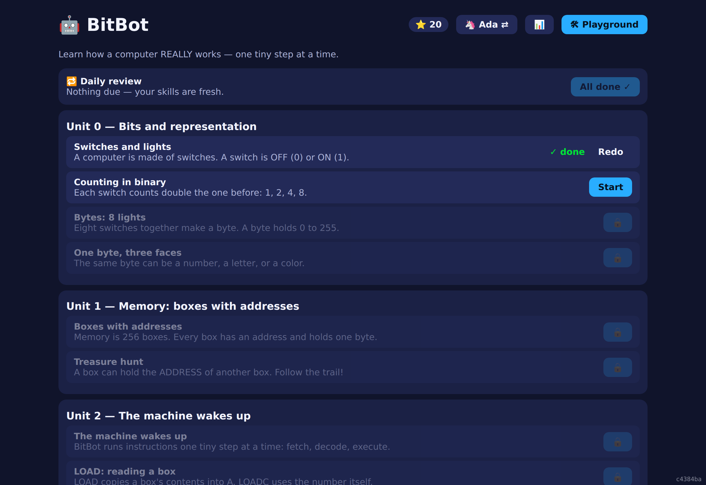
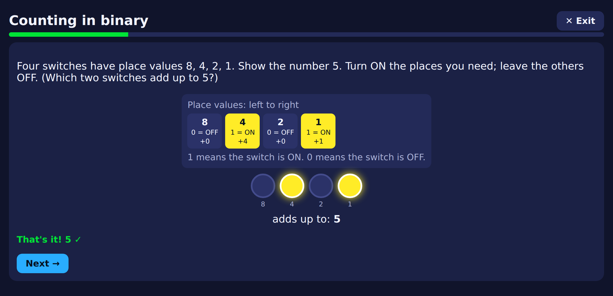
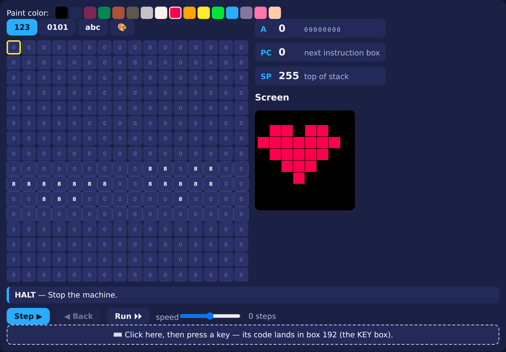
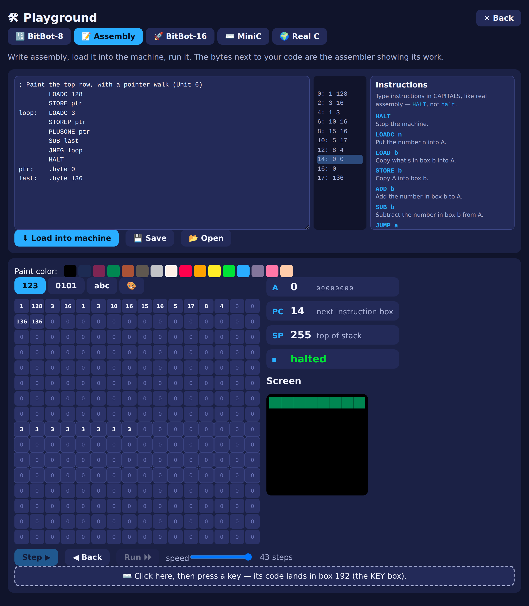
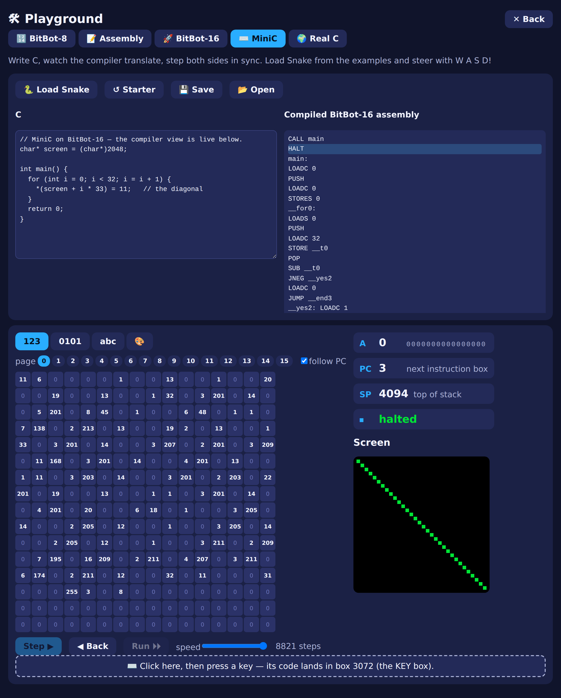
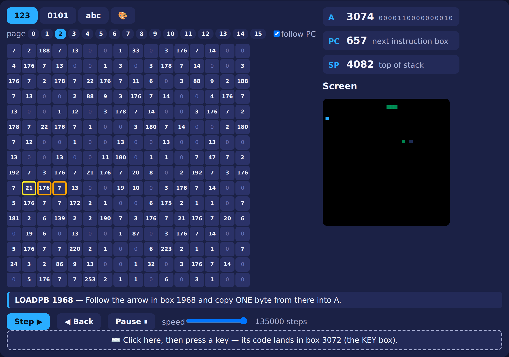
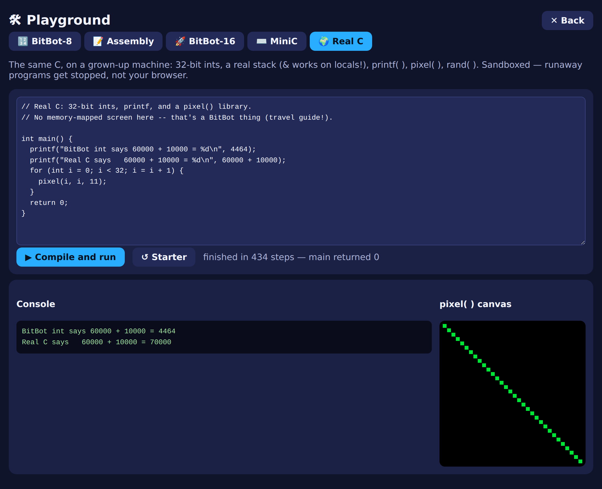
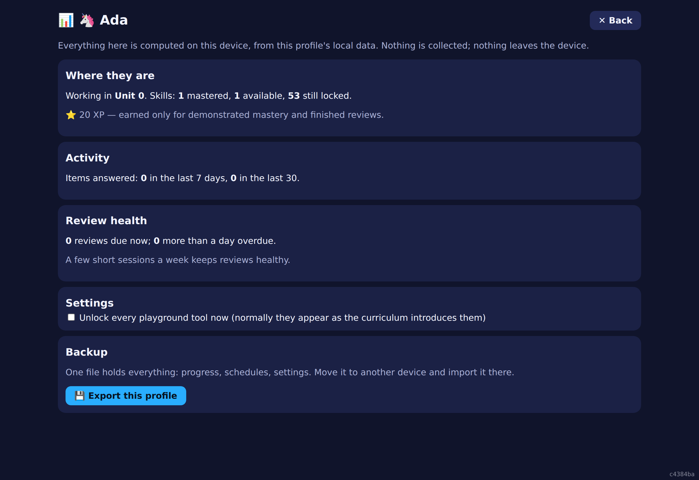

# 🤖 BitBot

**A hardware-first computer-science course for ages 8–12 that runs entirely in your browser.**

Most coding-for-kids apps start at the top — drag some blocks, call a function, trust
the magic. BitBot starts at the bottom. Kids learn the *machine* first: switches, memory
boxes, a tiny CPU they can single-step. Then every "big idea" that follows — variables,
pointers, functions, even C — is introduced as a **name for something they've already
moved around with their own hands.**

No server. No accounts. No data collected. It's a single web app you can host anywhere.

<p align="center">
  
</p>

---

## Learn the machine, one tiny step at a time

Lessons are short and hands-on. A kid doesn't *read* that 5 is `0101` in binary — they
flip the switches until the lamps add up to 5, with a place-value scaffold that quietly
fades as they get it.

<p align="center">
  
</p>

Behind the friendly surface is a real learning engine:

- **A knowledge graph** — one skill per lesson, with prerequisite gates, so nothing
  unlocks before its foundations are solid.
- **Spaced review** — an FSRS-style scheduler surfaces a short daily review of things
  starting to go stale. Practicing an advanced skill also refreshes the simpler ones it's
  built on, so review stays quick as the tree grows.
- **A placement check** at sign-up, so a kid who already knows binary doesn't have to sit
  through it.
- **Many kinds of exercise** — predict what the machine does next, fill in a trace table,
  reassemble shuffled code, hunt the bug, write a program that hits a target picture, speed
  drills. Randomized starting states mean there's nothing to memorize — you have to actually
  reason about the machine.

Every graded exercise is **machine-checked**: the intended solution is run through the real
VM and must pass, the buggy starter must fail. The content can never quietly drift out of
sync with how the machine actually behaves.

---

## The screen *is* memory

BitBot-8 is a simulated 8-bit computer: 256 memory boxes, three registers, a 17-instruction
CPU, and an 8×8 screen that lives *inside* memory (boxes 128–191). Paint a pixel and watch
its box change to that color's number. Poke the box and watch the pixel light up. That one
idea — *the screen is just memory* — is the whole foundation for graphics later on.

<p align="center">
  
</p>

The VM is a pure function — `(state) → state` — which makes it **deterministic and fully
step-back-able**: every "◀ Back" button rewinds the machine exactly, so mistakes are just
one click to undo.

---

## From assembly...

Once the raw numbers get tedious, kids meet the assembler: names instead of opcode numbers,
labels instead of addresses. The assembled bytes sit *right next to* the source, so the
translation is never a black box — you can see `LOADC 3` become the numbers `1 3`.

<p align="center">
  
</p>

And the errors talk like a patient teacher, not a compiler:

> I don't know a box called `cont` — did you mean `count`?

---

## ...to C, compiled right in front of you

This is the payoff. **MiniC** is a real subset of C — `char`/`int`, pointers, arrays,
structs, `if`/`while`/`for`, functions, strings — that compiles to BitBot-16 assembly. The
compiler view steps the C and the generated assembly **in sync**, so a kid literally watches
`*p = 3;` turn into a `STOREP` instruction and paint a pixel.

<p align="center">
  
</p>

BitBot-16 is the grown-up sibling of BitBot-8 — 16-bit words, 4 KB of memory, a 32×32
screen — unlocked exactly when the curriculum needs bigger numbers and a bigger canvas.

---

## Build a real game

Snake ships as a MiniC example: steer with **W / A / S / D**, paced by the machine's
built-in tick. It compiles and runs like anything else — memory churning on the left, the
snake slithering across the memory-mapped screen on the right.

<p align="center">
  
</p>

---

## Real C, too

The final unlock is a sandboxed **real-C** interpreter for the same language, on a
"grown-up" machine: 32-bit ints, a real stack (so `&` works on locals), and `printf()` /
`pixel()` / `rand()`. It's a great way to *feel* the difference between a toy 8-bit int and
a real one — watch `60000 + 10000` overflow on BitBot but come out right here.

<p align="center">
  
</p>

It's sandboxed by construction — a runaway program hits a step budget or a stack wall and
gets stopped with a kid-readable message, instead of freezing the browser.

---

## The curriculum

**43 lessons across 16 units**, from a single switch all the way to a game loop and real C:

| Units | Journey |
|------:|---------|
| **0–2** | Bits → memory boxes with addresses → the CPU wakes up (fetch, decode, execute) |
| **3–5** | Arithmetic and the first pixels → the assembler → loops and jumps |
| **6–8** | Pointers in assembly → the stack, `CALL` and `RET` → inventing a language |
| **9–12** | MiniC: variables and types → control flow → functions → **pointers in C** |
| **13–15** | Arrays and strings → structs and memory layout → capstone game + real C |

The full design and pedagogy live in [`docs/DESIGN.md`](docs/DESIGN.md).

---

## For grown-ups

- **Local profiles** — each kid gets a name and an avatar (no passwords — a convenience,
  not a security wall). Progress lives in the browser, and the whole thing — progress,
  review schedules, settings — exports to a single file you can carry to another device.
- **A parent dashboard** — where they are, what they've mastered, how review is going, all
  computed on the spot from local data. There's a tiny "grown-ups only" arithmetic gate in
  front of it and an "unlock every playground tool" switch for free exploration.
- **Genuinely private** — everything is client-side. **No child's data is collected or
  ever leaves the device.**

<p align="center">
  
</p>

---

## Run it

```sh
npm install
npm run dev      # start the dev server
npm run build    # typecheck + production build
```

It's a static site — the production build in `dist/` can be served from anywhere.

Working on BitBot itself? See **[`docs/DEVELOPMENT.md`](docs/DEVELOPMENT.md)** for the
project layout, the testing setup, and the architectural decisions worth knowing.
